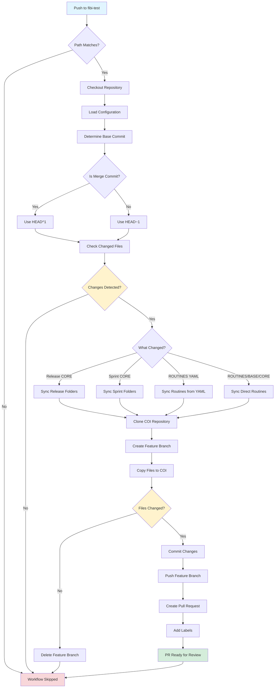
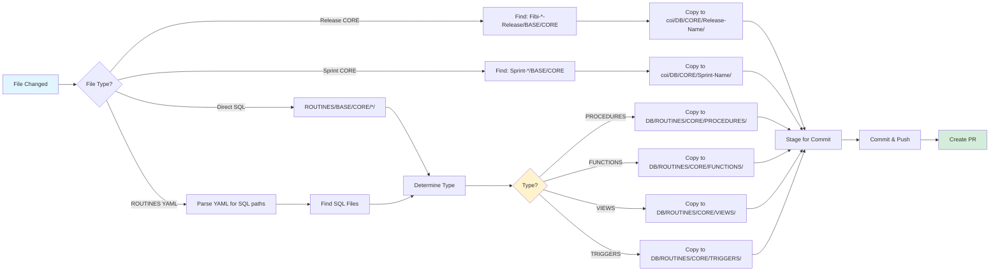
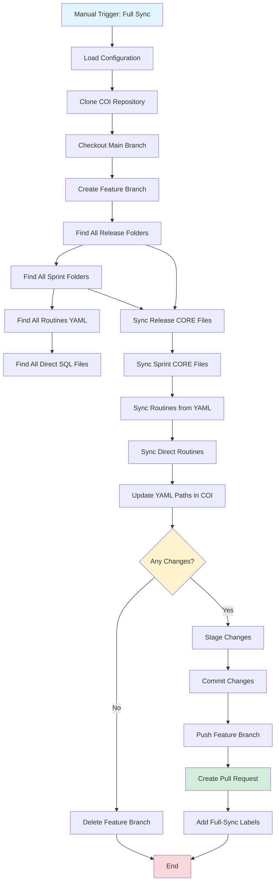
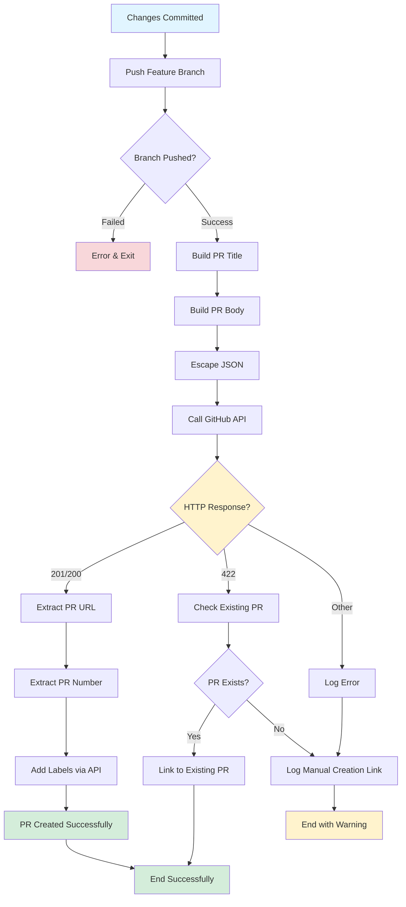
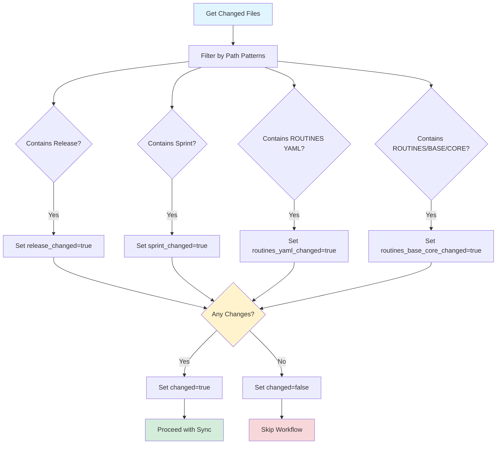
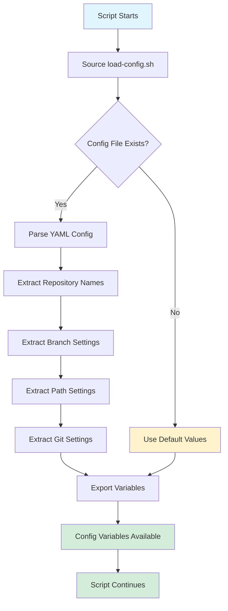
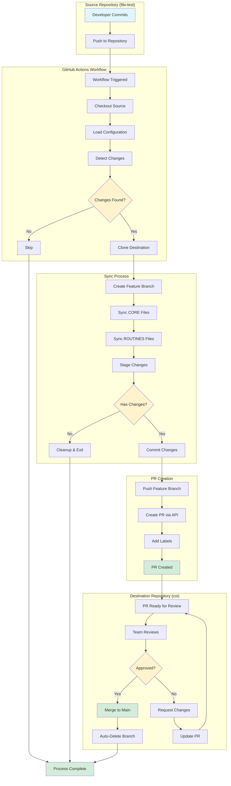

# Sync Workflow Flowchart

This document contains flowcharts that visualize the sync process between `fibi-test` and `coi` repositories.

## Main Sync Workflow Flow



## Incremental Sync Process Detail



## Full Sync Process Flow



## Pull Request Creation Flow



## Change Detection Logic



## Configuration Loading Flow



## Branch Naming Convention

```mermaid
flowchart LR
    A[Source Branch] --> B[Clean Branch Name]
    B --> C[Get Timestamp]
    C --> D{Sync Type?}
    
    D -->|Incremental| E[Category: core-sync]
    D -->|Full Sync| F[Category: full-core-sync]
    
    E --> G[Format: Fibi-Dev/core-sync/{branch}-{timestamp}]
    F --> H[Format: Fibi-Dev/full-core-sync/{branch}-{timestamp}]
    
    G --> I[Truncate to Max Length]
    H --> I
    I --> J[Feature Branch Created]
    
    style A fill:#e1f5ff
    style J fill:#d4edda
    style D fill:#fff3cd
```

## File Sync Decision Tree

```mermaid
flowchart TD
    A[File Detected] --> B{Location?}
    
    B -->|Release Folder| C[Fibi-*-Release/BASE/CORE]
    B -->|Sprint Folder| D[Sprint-*/BASE/CORE]
    B -->|ROUTINES YAML| E[**/BASE/CORE/*.yaml]
    B -->|Direct SQL| F[ROUTINES/BASE/CORE/*/*.sql]
    
    C --> G{File Type?}
    D --> G
    
    G -->|YAML| H[Copy to DB/CORE/{Folder}/]
    G -->|SQL| I[Extract from YAML Path]
    
    E --> J[Parse YAML]
    J --> K[Find SQL Files]
    K --> I
    
    F --> L{Determine Routine Type}
    I --> L
    
    L --> M{Type?}
    M -->|PROCEDURES| N[DB/ROUTINES/CORE/PROCEDURES/]
    M -->|FUNCTIONS| O[DB/ROUTINES/CORE/FUNCTIONS/]
    M -->|VIEWS| P[DB/ROUTINES/CORE/VIEWS/]
    M -->|TRIGGERS| Q[DB/ROUTINES/CORE/TRIGGERS/]
    
    H --> R[Destination]
    N --> R
    O --> R
    P --> R
    Q --> R
    
    R --> S[Copy File]
    S --> T[Stage for Commit]
    
    style A fill:#e1f5ff
    style T fill:#d4edda
    style M fill:#fff3cd
    style L fill:#fff3cd
```

## Complete End-to-End Flow



## Notes

- All flowcharts are created using Mermaid syntax
- These diagrams can be viewed in:
  - GitHub (renders automatically)
  - VS Code with Mermaid extension
  - Online Mermaid editors (mermaid.live)
  - Documentation sites (GitBook, etc.)

## Key Decision Points

1. **Path Matching**: Only files matching specific patterns trigger the workflow
2. **Change Detection**: Compares against base commit (handles merge commits)
3. **File Type Classification**: Routes files to correct destination based on type
4. **PR Creation**: Handles success, failure, and existing PR scenarios
5. **Branch Management**: Follows naming convention and auto-deletes after merge

